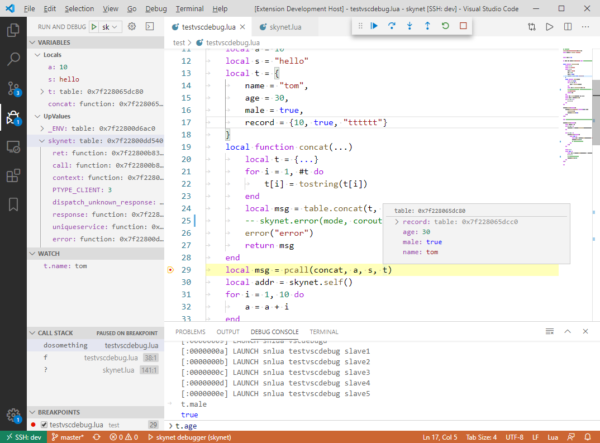

Skynet Lua Debug Adapter

## snapshot

## Features

这是用于调试[skynet](https://github.com/colinsusie/skynet)程序的Lua Debug Adatper，它提供如下特性：

- skynet的日志会输出到`DEBUG CONSOLE`面板，并且点击日志可以跳转到具体的代码行。
- 设置断点，除了普通断点，还支持以下几种断点：
    - 条件断点：当表达式为true时断下来。
    - Hit Count断点，命中指定次数后断下来。
    - 日志断点，命中时输出日志，日志中可以包含表达式。
- 程序命中断点停下来时：
    - 查看调用堆栈。
    - 查看每一层栈帧的局部变量，自由变量。
    - 通过`WATCH`面板增加监控的表达式。
    - 可在`DEBUG CONSOLE`底部输入表达式来求值，甚至可以修改局部变量的值。
    - 鼠标悬念在变量上查看变量的值。
- 支持`Step into`, `Step over`, `Step out`, `Continue`等调试命令。

## User Guides

请移步这里阅读：[https://github.com/colinsusie/skynetda](https://github.com/colinsusie/skynetda)

## Release Notes

### 0.9.0

第1个发布版本

**Enjoy!**
